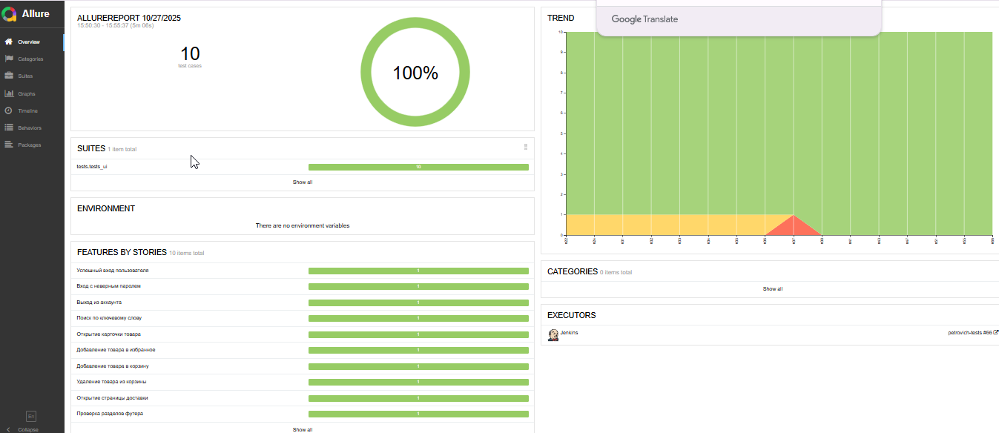
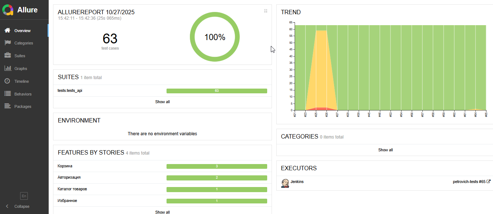

# Автоматизация тестирования онлайн-магазина «Петрович»

---

## 🗂 Содержание

- [🎯 Цель проекта](#-цель-проекта)
- [⚙️ Технологии и инструменты](#-технологии-и-инструменты)
- [✅ Реализованные сценарии](#-реализованные-сценарии)
  - [UI-тесты](#ui-тесты)
  - [API-тесты](#api-тесты)
- [🚀 Запуск тестов в Jenkins с параметрами](#-запуск-тестов-в-jenkins-с-параметрами)
- [📊 Отчёт о результатах тестирования в Allure Reports](#-отчёт-о-результатах-тестирования-в-allure-reports)
- [📩 Уведомления в Telegram о результатах прогона](#-уведомления-в-telegram-о-результатах-прогона)
- [🎥 Видео-отчёт прохождения UI-тестов](#-видео-отчёт-прохождения-ui-тестов)
- [📸 Скриншоты при падении](#-скриншоты-при-падении)

---

## 🎯 Цель проекта

Автоматизация ключевых пользовательских сценариев на сайте **petrovich.ru**, включая:
- Авторизацию и управление сессией.
- Работу с корзиной и избранным.
- Поиск и просмотр товаров.
- Навигацию по сервисам (доставка, подъём).
- Валидацию API-ответов с JSON Schema.

Проект охватывает как **UI**, так и **API** слои, обеспечивая комплексную проверку функциональности.

---

## ⚙️ Технологии и инструменты

| Категория       | Инструменты |
|------------------|-------------|
| Язык             | Python 3.10+ |
| Фреймворк тестов | Pytest |
| UI-автоматизация | Selenium + Page Object Model |
| API-тестирование | Requests + JSON Schema |
| Отчёты           | Allure Report |
| CI/CD            | Jenkins (параметризованный запуск) |
| Уведомления      | Telegram Bot |
---

## ✅ Реализованные сценарии

### UI-тесты
- ✅ Успешная авторизация
- ❌ Авторизация с неверным паролем
- 🚪 Выход из аккаунта
- 🔍 Поиск товара по ключевому слову
- 🛒 Добавление товара в корзину
- 🗑️ Удаление товара из корзины
- ❤️ Добавление в избранное
- 📦 Открытие карточки товара
- 🚚 Переход на страницу «Доставка и подъём»
- 📑 Проверка разделов футера

### API-тесты
- 📦 Получение товара по артикулу + валидация JSON Schema
- ➕ Добавление товара в корзину
- ➖ Удаление товара из корзины
- 🔢 Изменение количества товара
- ❤️ Добавление в избранное
- 🔐 Успешная авторизация
- 🔒 Авторизация с неверным паролем → ожидаемая ошибка 400

---

## 🚀 Запуск тестов в Jenkins с параметрами

Проект настроен на **параметризованный запуск** через Jenkins pipeline:

### 📌 Параметры запуска:
- `TEST_TYPE`: выбор типа тестов
  - `ui` — запуск только UI-тестов
  - `api` — только API
  - `all` — полный прогон

---

## 📊 Отчёт о результатах тестирования в Allure-reports

После прохождения тестов автоматически формируется отчёт в **Allure Report**. 
### Общий результат прогона UI-тестов

  

### Общий результат прогона API-тестов

